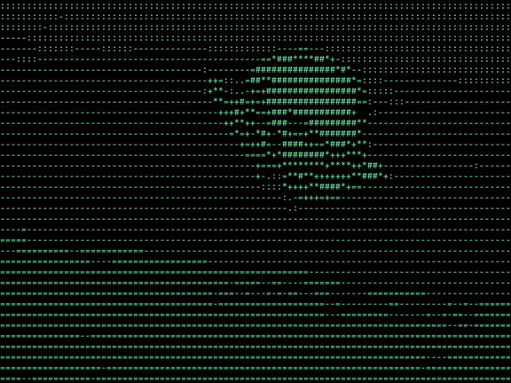

# ascii-video-cpp



[Watch or download the full MP4](assets/readme-demo/ascii-video.mp4) · [Poster](assets/readme-demo/poster.png) · [Demo source notes](assets/readme-demo/README.md)

A C++20 desktop app that converts local images and videos into rendered ASCII art.
Qt6 Widgets provides a terminal-style window; OpenCV decodes and prepares frames;
an external FFmpeg process writes H.264 MP4 and GIF.

**GitHub displays the demo and stores the assets. GitHub does not run this C++ desktop application.**

**Cài đặt hiện tại:** repository này cung cấp mã nguồn, chưa có bộ cài `Setup.exe` hay bản
portable kèm đầy đủ thư viện. Bạn cần cài dependency và build **một lần**. Sau đó mở
`ascii-video-cpp.exe` như một ứng dụng desktop; **không cần VS Code hoặc IDE để sử dụng**.

[Bắt đầu trên Windows](#build-on-windows) · [Cách sử dụng](#use-the-app) ·
[Export cho GitHub Profile](#github-profile-export) · [Ubuntu](#build-on-ubuntu)

## Use the app

Sau khi mở app theo hướng dẫn bên dưới:

1. **Import:** chọn ảnh hoặc MP4/video, hoặc kéo một file vào cửa sổ. Kiểm tra tên file,
   kích thước và FPS/thời lượng hiển thị. Nút Convert chỉ bật khi import thành công.
2. **Chỉnh thông số trước khi convert:** có thể giữ mặc định để thử lần đầu.

   - **Columns:** số cột ký tự; nhiều cột cho thêm chi tiết nhưng tốn thời gian và dung lượng hơn.
   - **Brightness / Contrast:** mặc định 0 / 1. Tăng brightness nếu ảnh ASCII quá tối.
   - **Charset:** chuỗi từ ký tự thưa đến dày, mặc định ` .:-=+*#%@`.
   - **Text:** chọn màu chữ xanh, trắng hoặc xám; bật **Source colors** để lấy màu từ video gốc.
   - **Threads:** số worker CPU, mặc định 4. **Preview FPS** chỉ điều chỉnh tần suất preview,
     không thay đổi FPS của MP4 xuất ra.

3. **Convert:** bắt đầu xử lý. Xem preview, progress, FPS xử lý, thời gian đã chạy và dung lượng
   output ở cuối cửa sổ. **Stop** hủy tác vụ đang chạy; bản chuyển đổi dở không được coi là thành phẩm.
4. **Download:** sau khi hoàn tất, chọn nơi lưu và tên file. Tên mặc định cho ảnh là `ascii-image.png`;
   video xuất thành `ascii-video.mp4` đầy đủ. Video ASCII hiện **không có âm thanh**.
5. **GitHub Profile:** chọn thời lượng GIF preview, giới hạn dung lượng và repository URL nếu có,
   rồi chọn thư mục cha. App tạo `github-export/` cùng snippet để bạn tự upload.
   Thư mục `github-export/` phải chưa tồn tại ở vị trí đó.

**Lưu trước khi đóng:** kết quả nằm trong thư mục tạm của app cho đến khi bạn dùng Download
hoặc GitHub Profile. Đóng app sẽ xóa bản tạm. Preview chạy khi chuyển đổi; khi xong app hiển thị
poster, chưa có thanh tua/phát lại. Mở MP4 đã Download bằng trình phát video để xem toàn bộ.

Import, conversion, download and profile export run outside the UI thread. Brightness is an additive
offset in [-255,255]; contrast in [0,4] is applied around gray 127.5 before clamping.
The 8×16 glyph cell gives:

```text
rows = round(input_height / input_width × columns × 8 / 16)
```

Rounding introduces at most half a character row of aspect error. Characters are printable
ASCII; multi-byte Unicode glyphs are rejected. Columns are 8–320 and rows have a 2048-row
resource guard. Default workers: 4. The UI allows 1–32 workers.

## Build on Windows

### Cài lần đầu với MSYS2 / MinGW

Đây là đường build đã được kiểm tra local và trong Windows CI.

**1. Cài MSYS2.** Tải từ [msys2.org](https://www.msys2.org/), cài đặt, rồi mở
**MSYS2 MINGW64** từ Start Menu. Các lệnh trong những khối `sh` dưới đây chạy trong
cửa sổ MINGW64, không dán trực tiếp vào PowerShell.

Cập nhật hệ thống:

```sh
pacman -Syu
```

Nếu MSYS2 yêu cầu đóng cửa sổ để cập nhật, làm theo hướng dẫn, mở lại **MINGW64** rồi chạy
`pacman -Syu` lần nữa đến khi cập nhật xong.

**2. Cài compiler, Qt6, OpenCV, CMake và FFmpeg:**

```sh
pacman -S --needed git mingw-w64-x86_64-gcc mingw-w64-x86_64-cmake \
  mingw-w64-x86_64-ninja mingw-w64-x86_64-qt6-base \
  mingw-w64-x86_64-opencv mingw-w64-x86_64-ffmpeg
```

**3. Tải source, build và chạy test:**

```sh
git clone https://github.com/dakiemdarktharr/ascii-video-cpp.git
cd ascii-video-cpp
cmake -S . -B build -G Ninja -DCMAKE_BUILD_TYPE=Release
cmake --build build --parallel 4
ctest --test-dir build --output-on-failure
```

Nếu đã dùng **Code → Download ZIP**, giải nén trước rồi dùng `cd` vào thư mục chứa
`CMakeLists.txt`; bỏ qua hai dòng `git clone` và `cd ascii-video-cpp`.
Chỉ chuyển sang bước mở app khi build thành công. Test thành công sẽ báo `100% tests passed`.

**4. Mở app:**

```sh
./build/ascii-video-cpp.exe
```

Một cửa sổ desktop sẽ mở. Không cần mở VS Code hay Visual Studio.

### Mở lại app những lần sau

Không cần cài hay build lại nếu source chưa thay đổi. Mở **MINGW64**, `cd` vào repository
và chạy `./build/ascii-video-cpp.exe`.

Hoặc mở PowerShell tại thư mục repository và chạy:

```powershell
$env:PATH = "C:\msys64\mingw64\bin;$env:PATH"
.\build\ascii-video-cpp.exe
```

Nếu MSYS2 được cài ở chỗ khác, thay `C:\msys64` bằng thư mục cài thực tế.
Dòng PATH chỉ áp dụng cho cửa sổ PowerShell hiện tại. Không copy riêng file EXE sang máy khác:
app còn cần các DLL của Qt/OpenCV/MinGW, Qt platform plugin và chương trình FFmpeg.

### Lỗi thường gặp

| Hiện tượng | Cách xử lý |
| --- | --- |
| `cmake`, `g++` hoặc `ninja` không được nhận diện | Mở đúng **MSYS2 MINGW64** và hoàn tất bước cài dependency. |
| Thiếu DLL hoặc Qt platform plugin khi mở EXE | Chạy từ MINGW64, hoặc dùng lệnh PowerShell có PATH ở trên. Không trộn thư viện MSVC với MinGW. |
| App báo không tìm thấy FFmpeg | Chạy `ffmpeg -version` trong cùng shell; cài package FFmpeg ở bước 2 nếu thiếu. |
| Không mở được video/codec | Thử video MP4 H.264; kiểm tra file có phát được bằng trình phát video. Codec hỗ trợ phụ thuộc backend được cài. |
| Export báo `github-export already exists` | Chọn thư mục cha khác hoặc đổi tên thư mục export cũ trước. |
| GIF vượt giới hạn dung lượng | Giảm preview xuống 5–8 giây hoặc tăng ngân sách trong hộp thoại export. |

### MSVC + vcpkg manifest (provided, not locally built)

Install Visual Studio 2022 with Desktop development with C++, CMake and Ninja.
Bootstrap [vcpkg](https://github.com/microsoft/vcpkg), set `VCPKG_ROOT`, and use a
Developer PowerShell for Visual Studio:

```powershell
cmake -S . -B build-msvc -G Ninja -DCMAKE_BUILD_TYPE=Release `
  "-DCMAKE_TOOLCHAIN_FILE=$env:VCPKG_ROOT/scripts/buildsystems/vcpkg.cmake" `
  -DVCPKG_TARGET_TRIPLET=x64-windows
cmake --build build-msvc --parallel 4
$env:PATH = "$PWD/build-msvc/vcpkg_installed/x64-windows/bin;$env:PATH"
$env:QT_PLUGIN_PATH = "$PWD/build-msvc/vcpkg_installed/x64-windows/Qt6/plugins"
ctest --test-dir build-msvc --output-on-failure
.\build-msvc\ascii-video-cpp.exe
```

The pinned `vcpkg.json` installs Qt Widgets/Test/PNG and OpenCV JPEG/PNG/FFmpeg support.
Its Qt feature selection follows the [qtbase port manifest](https://github.com/microsoft/vcpkg/blob/04a9d8e5212d01ee1dd9478eadd9caade4f8b0d4/ports/qtbase/vcpkg.json).
**Install the FFmpeg command-line executable separately** and add it to PATH. The OpenCV FFmpeg
library dependency does not replace that executable. Check `ffmpeg -encoders` for
`libx264` and `gif`. Alternatively set `ASCII_FFMPEG` to the executable's full path.
A missing executable/codec produces an error instead of a silent fallback to a different output format.

## Build on Ubuntu

```sh
sudo apt-get update
sudo apt-get install -y git cmake ninja-build g++ qt6-base-dev libopencv-dev ffmpeg fonts-dejavu-core
git clone https://github.com/dakiemdarktharr/ascii-video-cpp.git
cd ascii-video-cpp
cmake -S . -B build -G Ninja -DCMAKE_BUILD_TYPE=Release
cmake --build build --parallel 4
ctest --test-dir build --output-on-failure
./build/ascii-video-cpp
```

CMake requires 3.20+, Qt 6.2+ and OpenCV 4.x or 5.x. The Windows and Ubuntu CI jobs
both configure a fresh build, compile with warnings treated as errors and run CTest.
Ubuntu also decodes the checked-in demo assets.
Ubuntu, macOS and MSVC have not been executed in the local Windows environment; see
[validation notes](VALIDATION.md) for the actual checks.

## Terminal output

Print the first image/video frame as plain grayscale characters or ANSI truecolor:

```sh
./build/ascii-video-cpp --terminal assets/demo-source.png --columns 80
./build/ascii-video-cpp --terminal assets/demo-source.png --columns 80 --ansi
```

Use `QT_QPA_PLATFORM=offscreen` on a headless host. ANSI output requires a truecolor terminal.
Desktop colored rendering uses source pixel colors; ANSI output encodes colors as escape sequences.

## GitHub Profile export

Choose a parent directory with no existing `github-export` child. The exporter stages files in
a temporary directory and only publishes the folder after all outputs pass their limits.
It refuses to overwrite an existing export.

Image:

```text
github-export/
├── ascii-profile.png
└── profile-snippet.md
```

Video:

```text
github-export/
├── ascii-profile.gif
├── ascii-video.mp4
├── preview.png
└── profile-snippet.md
```

The default GIF uses the first 8 seconds (or the whole video if shorter), 10 FPS,
640-pixel width and a 5 MiB budget. Choose 1–15 seconds and a 1–20 MiB budget in the dialog.
The library additionally exposes width and FPS. It restricts input duration before palette
generation, uses a 64-color palette, then reduces width/FPS if necessary. If the GIF still
cannot fit, export fails and leaves no completed folder. Full-length MP4 is kept separately.

Enter `owner/repository` or its GitHub URL to produce real repository links; otherwise
the snippet uses `YOUR_GITHUB_USERNAME/YOUR_REPOSITORY`. Links use `HEAD` so they follow
the default branch. Upload the complete `github-export` directory at the repository root,
then copy the snippet into its README (for a profile, the repository normally matches your username).

ZIP creation and upload are not included. You can zip the generated folder with your OS.
The app contains no GitHub credentials or authentication integration.

## Pipeline and memory

```text
OpenCV decoder → bounded ring + job queue → CPU workers → ordered encoder → staged output
                           ↑ backpressure                  ↓
                                  latest-frame UI mailbox
```

A ring slot belongs to one sequence number until the encoder has written it. Workers can
finish out of order, but the encoder consumes the next sequence only. Holding a slot through
encoding bounds both decoded and completed frames, even when the earliest frame is slow.
The ring has 8 slots in the library default; the UI chooses min(16, 2 × workers).
Condition variables wake all stages on an error or cancellation. Threads are joined before
their captured state is destroyed.

The converter uses a 256-entry brightness/contrast-to-glyph lookup table and an immutable glyph
atlas shared by workers. Each worker reuses OpenCV resize/grayscale scratch buffers.
Frame Mats move between stages; QImage data is implicitly shared for preview/poster.
Rendered images/text are allocated per frame; this is not an allocation-free renderer.
The UI mailbox holds only the latest progress frame. FFmpeg's queued stdin is capped at roughly
256 KiB plus one row. Decoder/codec caches, worker scratch, the poster and preview add a fixed
amount outside the ring. Memory depends on resolution/settings, not a retained list of all frames.

## Video length

Không có giới hạn cứng theo phút/giờ cho MP4 đầu vào. Thời gian xử lý và dung lượng ổ đĩa
là giới hạn thực tế; pipeline không giữ toàn bộ video trong RAM. Bản hiện tại đã được đo
với input dài đến 120 giây, chưa có cam kết cho video dài nhiều giờ. Timeout của encoder
bảo vệ khi ghi bị kẹt hoặc hoàn tất quá lâu. Giới hạn 15 giây chỉ dành cho GIF preview.

## Tests, demo and benchmarks

```sh
ctest --test-dir build --output-on-failure
# Recreate all four assets from an original deterministic 6-second animation:
bash scripts/generate_preview.sh
# Actual stage timings as JSON:
QT_QPA_PLATFORM=offscreen ./build/ascii-benchmark assets/demo-ascii.mp4 build/benchmark.mp4 4 100
```

PowerShell demo generation: `.\scripts\generate_preview.ps1`.
The original synthetic demo is still available: [GIF](assets/demo.gif), [MP4](assets/demo-ascii.mp4),
[poster](assets/preview.png), [source pattern](assets/demo-source.png).
The C++ generator recreates these four synthetic assets; it does not replace the supplied clip at the top.
It draws a moving crescent and waves without downloaded media.
Rendered glyphs can vary with the OS monospace font, so output bytes are not cross-platform deterministic.
Source animation positions/pixels are deterministic.

Tests cover mapping, brightness/contrast, aspect ratio, ANSI colors, Unicode image paths,
invalid/missing/empty inputs, a container with no frames, unavailable encoder, output round trips,
fractional FPS, ordered frames, both profile exports, GIF duration/byte limits, bounded ring occupancy,
cancellation and both desktop workflows. A Qt timer checks that the UI event loop continues during work.
CTest writes `build/test-results.txt` and JUnit XML alongside its normal log.

See [benchmark methodology](benchmarks/README.md) and [measured validation](VALIDATION.md).
Set `ASCII_BUILD_BENCHMARKS=OFF` to omit the optional benchmark/demo target.
There is no promised conversion speed and no synthetic performance score.

## Current limits

- CPU conversion and software H.264 encoding only; hardware acceleration is not implemented.
- Output is silent. Audio and subtitles are not copied.
- MP4 uses the decoder-reported FPS as constant frame rate. Variable-frame-rate timestamps are
  not preserved; duration can differ for VFR inputs. Tests cover constant/fractional FPS.
- Preview is live during conversion, then shows the poster; there is no playback timeline.
- Import support depends on installed codecs. The vcpkg manifest enables JPEG/PNG and video
  decoding; additional still-image codecs may require additional OpenCV features.
- Processing is 8-bit SDR. HDR, alpha and color-management metadata are not preserved.
- OpenCV cannot distinguish every damaged-stream error from EOF. Known early EOF is rejected
  using advertised frame counts, but streams without trustworthy counts have that limitation.
- Stop is checked between local decode calls and during encoding/export. A blocked backend read
  or initial font/codec setup cannot be interrupted immediately.
- No installer or standalone DLL bundle is supplied. Run with the build dependencies available.

## License

[MIT](LICENSE) for project code and the original synthetic demo media.
The supplied-clip showcase has separate [source notes](assets/readme-demo/README.md);
the MIT license does not cover its underlying third-party animation. Qt, OpenCV, FFmpeg and system fonts
retain their own licenses. Review their redistribution terms when packaging binaries.
