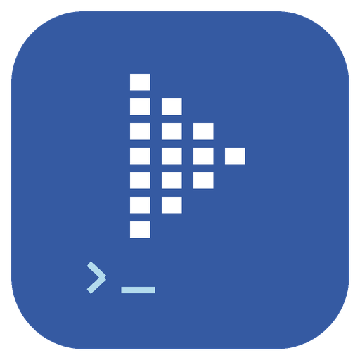
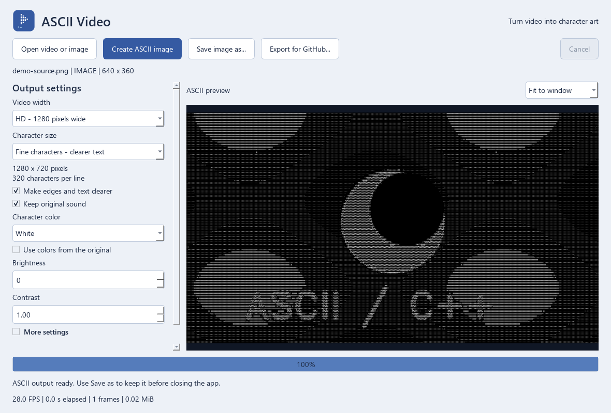
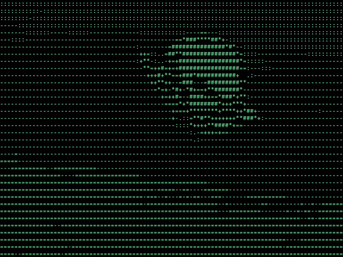

# ASCII Video



Convert MP4 videos and images into pure ASCII character art, with a desktop app or Docker.
Full HD output, fine characters and edge enhancement help retain subtitles and small text.
The saved MP4 keeps the original sound by default.



## Install

Download installers from [GitHub Releases](https://github.com/dakiemdarktharr/ascii-video-cpp/releases/latest).

| System | Download | Install |
| --- | --- | --- |
| Windows 10/11 x64 | [Setup.exe](https://github.com/dakiemdarktharr/ascii-video-cpp/releases/latest/download/Setup.exe) | Run it, then open ASCII Video C++ from the Start Menu. |
| Ubuntu 24.04 x64 | [ascii-video_1.2.0_amd64.deb](https://github.com/dakiemdarktharr/ascii-video-cpp/releases/latest/download/ascii-video_1.2.0_amd64.deb) | Run `sudo apt install ./ascii-video_1.2.0_amd64.deb`, then open ASCII Video. |
| macOS 15+ Apple Silicon | [arm64 DMG](https://github.com/dakiemdarktharr/ascii-video-cpp/releases/latest/download/ASCII-Video-macOS-arm64.dmg) | Open the disk image and drag ASCII Video to Applications. |
| macOS 15+ Intel | [x86_64 DMG](https://github.com/dakiemdarktharr/ascii-video-cpp/releases/latest/download/ASCII-Video-macOS-x86_64.dmg) | Open the disk image and drag ASCII Video to Applications. |

Windows and macOS bundles include Qt, OpenCV and FFmpeg. Ubuntu installs runtime dependencies through apt.
Source code archives are for developers; use the files above to install the app.
Installers are unsigned; Mac bundles use an ad-hoc signature and are not notarized.
Use the release's `SHA256SUMS.txt` to check downloads. Uninstall Windows through Settings → Apps;
on Mac remove the app from Applications; on Ubuntu run `sudo apt remove ascii-video`.

## Use the app

1. **Open video or image**, or drop a local file into the window. A first-frame ASCII preview appears.
2. Choose **Video width**: HD, Full HD (default), or 4K. **Fine characters** gives twice as many
   characters per line at the same output width as **Large characters**.
3. Adjust brightness, contrast and color. **Make edges and text clearer** is enabled by default.
   Choose **Actual size (100%)** to inspect subtitles in the preview; scroll to see the rest of the frame.
4. Click **Create ASCII video** (or image). **Cancel** discards unfinished work.
5. Click **Save video as...** to choose a permanent MP4 file. Save before closing: conversion results
   stay in a temporary folder until saved. Images save as PNG.

**Keep original sound** converts the first source audio track to AAC; uncheck it for silent output.
**More settings** contains characters per line (8–960), the character palette, CPU workers, and preview
updates per second. Preview updates do not change the saved video's frame rate.
Changing visual settings invalidates the previous conversion and updates the first-frame preview.
After conversion, the preview shows a still frame; play the saved MP4 in your video player.

**Export for GitHub...** writes a GIF, poster, full MP4 and README snippet into a local `github-export/`
folder. Choose a parent folder where `github-export/` does not already exist, then upload the files yourself.
GitHub hosts the source and downloads; the desktop conversion runs on your computer.

### Readable text and resolution

The old default sampled only 100 columns. The new Full HD default samples **480 columns** with **4×8**
pixel ASCII cells; the 4K preset samples **960 columns**. Every output pixel comes from a rendered ASCII
character on black; no original image or OCR text is blended into the output.
H.264 CRF 16 retains more fine detail. Output height follows the source aspect ratio, rounded to a character row:

```text
rows = round(input_height / input_width × columns / 2)
output = columns × cell_width by rows × cell_height
```

A 1920×1080 input becomes exactly 1920×1080 or 3840×2160 with Fine characters. Portrait and unusual
aspect ratios keep their shape; the names HD/4K describe output **width**, not a forced 16:9 canvas.
Large characters use 8×16 cells. More pixels cannot recover text already too small or blurred in the source.
For the best text detail, use 4K, Fine characters and edge enhancement. Conversion and file size increase
with quality. A 2048-row and 32-megapixel guard limits extreme outputs; video length does not grow the frame queue.
The nominal source frame rate is preserved. Variable-frame-rate timing is not reproduced exactly.

## Docker

Install Docker with Compose. No compiler or native dependencies are needed on the host.

```sh
mkdir -p docker-data
# Linux hosts: allow the container user to write this media folder.
chmod 777 docker-data
docker compose up --build -d app
```

Open [the local browser desktop](http://localhost:6080/vnc.html?autoconnect=true&resize=remote).
Place videos in `docker-data`, open `/data` in the app's file picker, and save outputs under `/data`.
On Windows, create `docker-data` in Explorer or PowerShell; the chmod command is only for Linux.
The browser desktop listens on localhost. Stop it with `docker compose down`.

Headless conversion and all functional tests:

```sh
docker compose run --rm --build convert --convert /data/input.mp4 --output /data/ascii.mp4 --width 3840
docker compose run --rm --build test
```

The Dockerfile has build, test, runtime and gui targets. Runtime has no compiler or source tree:

```sh
docker build --target runtime -t ascii-video .
docker run --rm -v "$PWD/docker-data:/data" ascii-video --convert /data/input.mp4 --output /data/ascii.mp4
```

## Command line

```sh
ascii-video-cpp --convert input.mp4 --output ascii.mp4 --width 1920
ascii-video-cpp --convert input.mp4 --output ascii.mp4 --width 3840 --mute
ascii-video-cpp --convert photo.png --output ascii.png --classic --columns 240
ascii-video-cpp --terminal photo.png --columns 100 --ansi
```

On servers set `QT_QPA_PLATFORM=offscreen`. Without options the app opens its desktop window.
See `--help` for worker count, edge enhancement and other options.

## Build from source

C++20, CMake 3.20+, Qt 6.2+ Widgets/Test, OpenCV 4.x or 5.x and FFmpeg with libx264 are required.

**Windows, MSYS2 MINGW64 shell:**

```sh
pacman -S --needed git mingw-w64-x86_64-gcc mingw-w64-x86_64-cmake \
  mingw-w64-x86_64-ninja mingw-w64-x86_64-qt6-base mingw-w64-x86_64-opencv \
  mingw-w64-x86_64-ffmpeg mingw-w64-x86_64-python mingw-w64-x86_64-nsis
```

**Ubuntu 24.04:**

```sh
sudo apt update
sudo apt install build-essential cmake ninja-build qt6-base-dev libopencv-dev ffmpeg fonts-dejavu-core
```

**macOS, Homebrew:**

```sh
brew install cmake ninja qt opencv ffmpeg dylibbundler
export CMAKE_PREFIX_PATH="$(brew --prefix qt)"
```

Then on each system:

```sh
git clone https://github.com/dakiemdarktharr/ascii-video-cpp.git
cd ascii-video-cpp
cmake -S . -B build -G Ninja -DCMAKE_BUILD_TYPE=Release -DCMAKE_COMPILE_WARNING_AS_ERROR=ON
cmake --build build --parallel 4
ctest --test-dir build --output-on-failure
```

Run `./build/ascii-video-cpp` on Linux, `./build/ascii-video-cpp.exe` on Windows, or
`open build/ascii-video-cpp.app` on Mac. Windows development builds need MINGW64's bin directory on PATH.
Use the installer to distribute the app, rather than copying only the executable.

[Packaging and release process](packaging/README.md) · [Validation record](VALIDATION.md)

## Demo



[Full MP4](assets/readme-demo/ascii-video.mp4) · [Source notes](assets/readme-demo/README.md)

The existing demonstration assets predate the new quality defaults. Core conversion uses a bounded frame queue,
bundled glyph atlases and worker-local OpenCV scratch buffers.
The glyph bitmaps are generated from DejaVu Sans Mono and stay identical across platform font engines. Qt Widgets runs the desktop UI; OpenCV decodes
media; an external FFmpeg process encodes H.264 and preserves audio. `ASCII_FFMPEG` can override FFmpeg's path.

Application source is MIT licensed. Bundled binaries include third-party GPL components; corresponding sources,
build recipes and runtime manifests are included in release assets. See each bundle's third-party notices.
